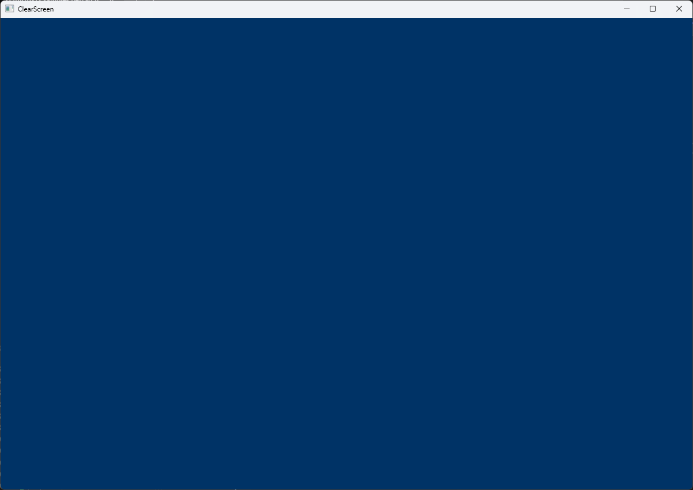
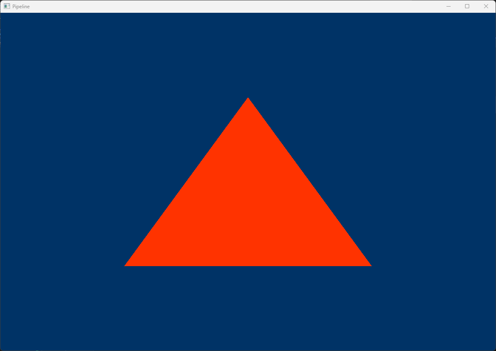
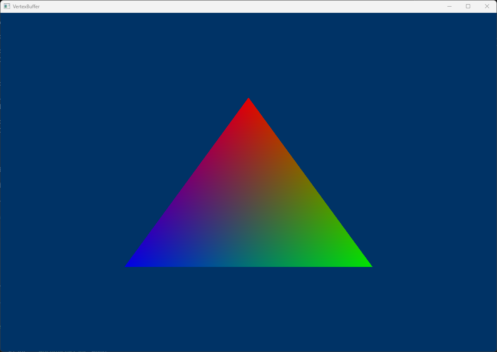
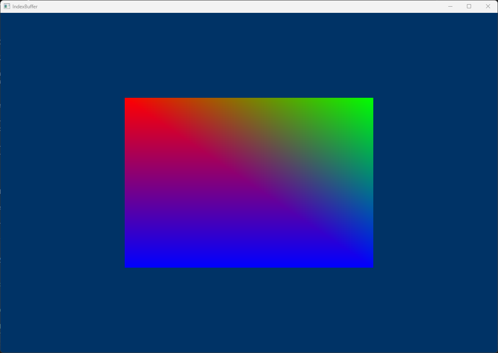
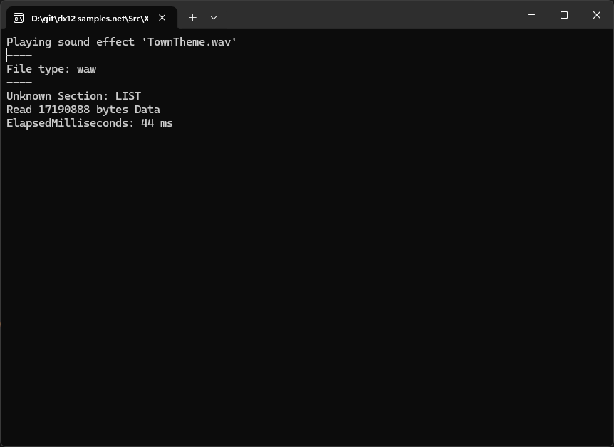

##               DirectX 12 Samples
  
</h1>

  ##              

## Overview
This is designed for the DirectX 12 learning process, I mainly use it to experiment with graphical or computing techniques and should not be used as a cerium product as it may have memory leaks and faulty or poorly optimized implementations.

## Examples

Example | Details
---------|--------
 | [Clear Screen](Src/Samples/Samples/ClearScreen/ClearScreen.cs)  This example shows how to configure the device and clear the color.
 | [Triangle](Src/Samples/Samples/Triangle/Triangle.cs)  We will start drawing geometry onto the screen in this tutorial. We will learn more about Pipeline State Objects (PSO) and Root Sigantures. We will also learn about resource heaps, viewports, scissor rectangles
 | [Triangle](Src/Samples/Samples/Triangle/Triangle.cs)  Let's get some color in our scene. In this tutorial we will add color to our vertices to color our triangle. This involves updating the vertex shader to pass the color to the pixel shader, the pixel shader to output the color passed to it, the vertex structure to add a color attribute, and the input layout to include a color input element.
 | [Triangle](Src/Samples/Samples/Triangle/Triangle.cs)  In this tutorial we will learn how to use indices to define our triangles. This is useful because we can remove duplicate vertices, as many times the same vertex is used in multiple triangles.
 | [Triangle](Src/Samples/Samples/Triangle/Triangle.cs)  In this example we will see the XAudio2 sound API and how to load a .waw file
